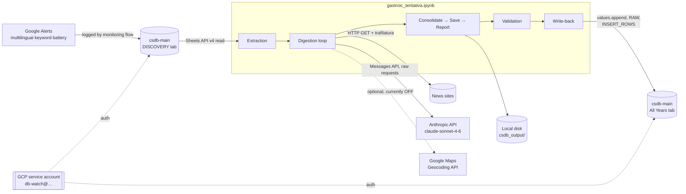
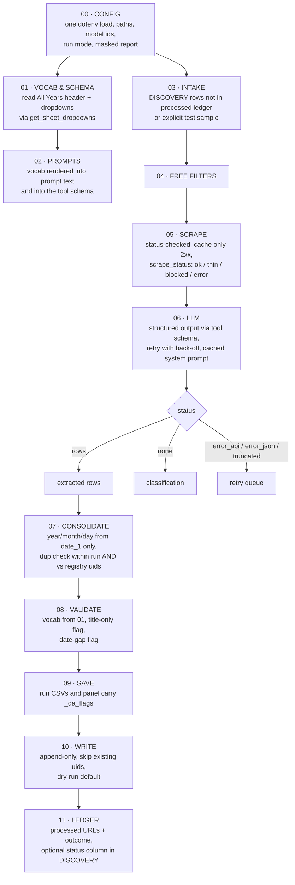

# CSDB Data Digestion Pipeline — Architectural Overview

| | |
|---|---|
| **Artifact** | `gastroic_tentativa.ipynb` (72 cells: 35 code, 37 markdown) |
| **Kernel** | `venv-cuina` · Python 3.12.3 |
| **Lineage** | Python port of `gastroic.Rmd` → `gastroic.ipynb` → `gastroic_python.ipynb` → this notebook |
| **Source / destination** | Google Sheet `csdb-main` — reads tab `DISCOVERY`, appends to tab `All Years` |
| **Last observed run** | 19 Sep 2026, run id `20260919_032703` — 10 URLs → 12 rows → 5 cleared for append (simulation mode) |
| **Status** | Working prototype. End-to-end chain runs; write-back is off by default. Not yet production intake. |
| **Owner** | MAD Unit, InSight Crime |

---

## 1. Purpose and position in the MAD workflow

The notebook turns raw monitoring observations into ordered registry rows for the Cocaine Seizures Database (CSDB). Google Alerts hits are logged in the `DISCOVERY` tab with a human triage label (`decision`). The pipeline takes a batch of those hits, resolves the real article URL behind the Google redirect, scrapes the article, asks Claude to extract one 45-column row per seizure event, falls back to a second Claude call that classifies the article when no event is found, consolidates and QA-flags the output, and finally appends clean rows to `All Years`.

In MAD terms it is the automation layer between *observation* (Monitor & Discover) and *record* (csdb-main). It replaces the manual step in which an analyst reads each alert and types the row by hand, while keeping the analyst in the loop through QA flags, a review queue, and a dry-run default on the write.

---

## 2. System context



Credentials and paths come from a dotenv file on the analyst's machine (`envia.txt` on Linux, `envia-ventanas.txt` on Windows). The service account must be shared on the workbook. Geocoding switches itself on only if `GOOGLE_MAPS_API_KEY` is present; in the observed run it was absent, so `GEOCODIFICAR = False`.

---

## 3. Stage map

| # | Stage | Cells | Consumes | Produces | External side effects |
|---|---|---|---|---|---|
| 0 | Timer start | 2 | — | `start_time` | — |
| 1 | Environment bootstrap | 7–8 | — | venv check, kernel registration | `pip install`, rewrites `requirements.txt` |
| 2 | Libraries | 10 | — | imports | — |
| 3 | Auth & services | 13–16 | dotenv | `creds`, `sheet_service`, `drive_service` | — |
| 4 | Workbook probe | 18 | `ORIGINAL_SPREADSHEET_ID` | file name, tab list, last modifier | Drive revisions read |
| 5 | Extraction of DISCOVERY | 20–25 | Sheets API | `df_target` (2,656 × 5), `dropdown_options`, `column_stats` | 3 full reads of `DISCOVERY` + 1 grid-data read |
| 6 | Model smoke test | 28–29 | API key | "Hello, world" response | 1 billable API call |
| 7 | Runtime config | 31, 33 | dotenv | `MODELO_CLAUDE`, `ANTHROPIC_KEY`, `UA`, `GOOGLE_KEY`, `GEOCODIFICAR`, `DIR_*` | creates `csdb_output/` tree |
| 8 | Sampling | 35 | `df_target` | `sample_10` (oldest 2026 month, `decision == Evidence`, seed 42) | — |
| 9 | Queue build (`ENTRADAS`) | 37 | `sample_10` | `entradas` (`url_google`, `titulo`, `fecha_alerta`, `_url_real`), deduped by resolved URL | — |
| 10 | Auxiliary functions | 40–41 | — | `get_claude_client`, `ask_claude`, `extraer_url_real`, `descargar_html`, `extraer_texto_limpio`, `muestrear_evidencia_mes_mas_antiguo` | — |
| 11 | Prompts | 43 | — | `PROMPT_EXTRACCION`, `PROMPT_CLASIFICACION` | — |
| 12 | Functional path (alternative) | 45 | aux + prompts | `COLUMNAS_45`, `procesar_fila`, `procesar_muestra` (**defined, never invoked**) | — |
| 13 | Raw API layer | 48 | config + prompts | `llamar_claude_generico`, `extraer_filas_csdb`, `clasificar_nota` | — |
| 14 | Free filters | 51 | `entradas` | `es_pagina_etiqueta`, `pasa_filtro_titulo`, `es_no_scrapeable`, zero-cost preview | — |
| 15 | Geocoding | 53 | config | `geocodificar` with disk cache | `geocache.json` |
| 16 | **Main loop** | 56 | everything above | `resultados` (list of DataFrames), `resumen` (list of dicts) | HTTP scrapes, 1–2 Claude calls per URL |
| 17 | Consolidate | 59 | `resultados`, `resumen` | `tabla_final` (+ `year/month/day`, `_grupo_duplicado`), `tabla_resumen` | — |
| 18 | Save | 62 | `tabla_final`, `tabla_resumen`, `entradas` | `tabla_final_out`, `panel_new` | 3 timestamped CSVs + panel append |
| 19 | Report | 65 | outputs of 17–18 | console summary | — |
| 20 | Validation | 67 | `tabla_final_out` | `_qa_flags` column, `incidencias_qa` | `validacion_<ts>.csv` |
| 21 | Write-back | 69 | `tabla_final_out`, `COLUMNAS_45` | `filas_matriz` aligned to live header | `values.append` to `All Years` **only if `WRITE_BACK = True`** |
| 22 | Close | 71 | `start_time` | elapsed time | — |

---

## 4. Per-URL decision logic (main loop, cell 56)

```mermaid
flowchart TD
    A[entradas row] --> B[extraer_url_real]
    B --> C{es_pagina_etiqueta?}
    C -- yes --> D1[Discard: página de etiqueta]
    C -- no --> E{pasa_filtro_titulo?}
    E -- no --> D2[Discard: título irrelevante]
    E -- yes --> F{es_no_scrapeable?}
    F -- yes --> G[texto = empty<br/>scrape_status = no_scrapeable]
    F -- no --> H[descargar_html → trafilatura]
    H --> I{len texto > 300?}
    I -- yes --> J[scrape_status = ok]
    I -- no --> K[scrape_status = texto_pobre]
    G --> L[extraer_filas_csdb<br/>PROMPT_EXTRACCION, 15k char cap]
    J --> L
    K --> L
    L --> M{rows returned?}
    M -- yes --> N[geocodificar each row<br/>stringify all fields<br/>attach _url_original, _titulo_alerta,<br/>_fecha_alerta, _scrape_status]
    N --> O[resumen: decision = Evidence<br/>razon = 'N fila(s) extraída(s)']
    M -- no / API error / invalid JSON --> P[clasificar_nota<br/>PROMPT_CLASIFICACION, 8k char cap]
    P --> Q[resumen: Evidence / Potentially Interesting / Discard]
```

The design principle is "spend nothing before you must": two free regex gates run before any network or token cost, and the filters are deliberately permissive (`FILTRO_TITULO_ESTRICTO = False`), so a doubtful article goes to Claude rather than being silently dropped. When the article body cannot be read, the prompt explicitly supports title-only extraction.

---

## 5. Data model and key in-memory structures

| Object | Shape / schema | Lifetime |
|---|---|---|
| `df_target` | `date-added`, `report`, `link`, `monitoring-provenance`, `decision`; all strings, empty → `NA` | Whole session |
| `dropdown_options` | `{column: [allowed values]}` from `DISCOVERY` data validation; observed `decision ∈ {Discard, Evidence, New Entry, Potentially Interesting}` | Whole session |
| `entradas` | `url_google`, `titulo`, `fecha_alerta`, `_url_real`; all `str`, no `NA` (the loop calls `len()` on titles) | Stage 9 → 18 |
| `resultados` | list of per-URL DataFrames: 45 CSDB columns + `lat`, `lon`, `geo_lugar`, `geo_precision`, `_url_original`, `_titulo_alerta`, `_fecha_alerta`, `_scrape_status` | Stage 16 → 17 |
| `resumen` | one dict per URL: `i`, `url`, `decision`, `razon`, `scrape_status` | Stage 16 → 19 |
| `tabla_final_out` | consolidated rows + `_grupo_duplicado`, `_run_id`, later `_qa_flags` | Stage 18 → 21 |
| `COLUMNAS_45` | canonical ordered CSDB schema (defined in cell 45) | Used by stages 12 and 21 |
| `filas_matriz` | list of lists aligned to the **live** `All Years` header row | Stage 21 |

The 45-column schema appears in three places inside the notebook (prompt text, `COLUMNAS_45`, and implicitly the `All Years` header) and the controlled vocabularies in two (prompt text and `VOCABULARIOS` in cell 67). Section 9 covers why this matters.

---

## 6. Persistence layout

```
csdb_output/
├── espejos_html/                  # HTML mirror cache, key = md5(url)[:16].html; reused if > 2,000 bytes
├── corridas/                      # one set per run, never overwritten
│   ├── resultado_<ts>.csv         # extracted rows (before QA flags)
│   ├── resumen_<ts>.csv           # per-URL audit trail
│   ├── no_new_entry_<ts>.csv      # URLs with no extracted rows, joined back to title and alert date
│   ├── validacion_<ts>.csv        # QA incidents (review queue), only when incidents exist
│   ├── extraido_<ts>.csv          # ┐ functional path only (cell 45) —
│   ├── clasificado_<ts>.csv       # │ never produced in the current flow
│   └── auditoria_<ts>.json        # ┘
├── panel_acumulado.csv            # every run's rows appended; 38 rows after the observed run
├── geocache.json                  # geocoding cache (empty while geocoding is off)
└── json_invalido_<md5[:8]>.txt    # raw Claude output when extraction JSON fails to parse
```

Encoding is `utf-8-sig` for all CSVs so they open cleanly in Excel with accents intact.

---

## 7. Configuration and secrets

`RUNTIME CONFIG` (cell 33) is the intended single source of truth. It probes the Linux path first and the Windows path second, creates the output directories, fixes the model identifier, sets a desktop-Chrome user agent, aligns `MAD_CLAUDE_API_KEY` and `ANTHROPIC_API_KEY` (the SDK path and the raw-requests path read different names), switches geocoding on from the presence of a Maps key, and prints a masked configuration report. That cell is well built. The problem is that four earlier cells (13, 14, 28, 31) and the auxiliary block (40) still load the dotenv file or define the same globals independently, so the "single source of truth" is in practice the last cell that happened to run. The dotenv loader also warns on every load that it cannot parse line 2 of `envia.txt`.

Write-back is governed by five constants at the top of cell 69: `WRITE_BACK` (default `False`), `DESTINO_SPREADSHEET_ID` (currently the same workbook as the source), `DESTINO_TAB = "All Years"`, `SOLO_SIN_FLAGS = True`, and `GENERAR_UID = True`.

---

## 8. Integrity controls already in place

The notebook already encodes most of the unit's data-integrity doctrine, and these properties should be preserved through any refactor.

The write is **append-only** (`INSERT_ROWS`) and never reorders or overwrites existing registry records. It starts in **simulation mode**, so the first run of any new configuration only shows the mapping and the rows that would be written. Columns are mapped **by name against the live header**, not by position, so a column moved in the sheet does not corrupt the append; the observed run mapped 45 of 45. Validation **flags rather than fixes**: nothing is corrected silently, flagged rows are held back from the write and stay in the run CSV for manual review, and incidents go to a dedicated review-queue file. Duplicate detection likewise **marks** candidate groups (`_grupo_duplicado`) instead of deleting them. Every run is **timestamped** and the panel is append-only, giving a full history. HTML mirrors make re-runs cheap and reproducible for the scraping step. Traceability columns (`_url_original`, `_titulo_alerta`, `_fecha_alerta`, `_scrape_status`, `_run_id`) link each extracted row back to its alert. Deterministic `CS_` + md5 uids are generated from source link, date, quantity, country and description when the model leaves `uid` empty.

---

## 9. Observed run, 19 Sep 2026

| Metric | Value |
|---|---|
| Input | 10 `Evidence` rows sampled from June 2026 (193 eligible) |
| Scrape outcome | 7 `ok`, 3 `texto_pobre` (41, 118 and 0 characters of body text) |
| Claude extraction | 7 URLs yielded rows, 12 rows total; 1 URL returned invalid JSON |
| Fallback classification | 2 Potentially Interesting, 1 Discard (cannabis only) |
| Consolidation | 6 rows flagged as possible duplicates (the same ELN 1.5 t seizure reported by Pulzo and El Diario, 3 rows each) |
| Validation | 5 clean, 7 flagged (6 duplicates, 1 description ≥ 15 words) |
| Write-back | 5 rows ready, not written (simulation) |
| Wall time | 181 s for the whole notebook, including setup |

Three things in this run are worth reading as architectural signals rather than one-off quirks. The duplicate detector produced a true positive across two outlets, which validates the country + date + quantity-bucket approach. The invalid-JSON case was routed into the classification branch and came back as "Potentially Interesting", so a parse failure became an editorial decision. And two of the five rows cleared for append were extracted from titles alone (41 and 118 characters of body text), including a Brazilian case of an adolescent apprehended "with drugs" that was recorded as `All/Unspecified/Multiple`; nothing in the QA stage looks at `_scrape_status`, so title-only rows pass as clean.

The embedded outputs also come from more than one session: cells 2 and 8 are stamped 22 Sep 2026 while the run artifacts and closing cell are stamped 19 Sep. Treat the saved outputs as indicative, not as a single reproducible run.

---

## 10. Risk register

Severity reflects impact on registry integrity and security first, maintainability second.

| ID | Severity | Finding | Where | Consequence |
|---|---|---|---|---|
| R1 | **Critical** | A Google API key and search-engine CX are hardcoded in a commented block, and cell 28 prints the raw Anthropic key (`Raw value` / `Repr value`) to output. Cell 13 prints the service-account key path. | 14, 28, 13 | Credentials exposed in the notebook, its outputs, and any git history containing them. The cell-40 docstring already records one push-protection incident. |
| R2 | **Critical** | Controlled vocabularies in the notebook conflict with the canonical CSDB vocabulary used by the unit's `cocaine-seizures` extraction skill. `minor_involved` is enforced as `true`/`false` here but is `Yes`/blank in the skill; `quantity_unit` lacks `Percent`, `Pounds (£)` and `Other currency (say which in Description)`; `sub_modus_operandi` uses a bare `Other` and lacks `Man-powered boat`, `Single-prop aircraft`, `Passenger ferry`, `Submarine`, `Private Boat`, `Mail Shipment`; `event_type` adds `Combined event`, which the skill does not have. | 43, 67 | Rows that pass validation can still be off-vocabulary in `All Years`, and the two MAD extraction routes (skill and notebook) produce incompatible values for the same field. Which list is authoritative must be settled against the live `All Years` dropdowns. |
| R3 | **Critical** | Pipeline failures are converted into editorial decisions. API errors and invalid JSON in extraction return `[]`, which triggers classification; an API or JSON error in classification defaults to `Potentially Interesting`. | 48, 56 | Technical failures are indistinguishable from real triage outcomes in `resumen` and `no_new_entry`, and are never retried. |
| R4 | **Critical** | No idempotency against the registry. The generated uid is never compared with uids already in `All Years`, the panel appends without dedup, and duplicate detection runs within a single run only. | 59, 62, 69 | Re-running the same batch with `WRITE_BACK = True` appends the same events again. The panel already mixes repeated test runs (38 rows). |
| R5 | High | Two parallel implementations of the same digestion. Cell 45 (SDK, `procesar_muestra`) is defined but never called; the main loop uses the raw-requests layer in cell 48. They differ in text caps, user-message format, error defaults, title detection (cell 45 does not recognise the `report` column, so titles would be lost), uid source (`uid` does not exist in `DISCOVERY`), and output files. `COLUMNAS_45`, which the write stage requires, lives only in the unused path. | 45, 48, 56, 69 | Maintenance drift and a hidden dependency: deleting the "dead" path breaks the write. |
| R6 | High | Redefinition sprawl. `get_sheet_data` ×3 (three full reads of `DISCOVERY`, last definition wins), `extraer_url_real` ×3, `descargar_html` and `extraer_texto_limpio` ×2, `DIR_*` ×3, `UA` ×2, dotenv loaded ×4, model identifier in at least four places, sampling logic ×2. | 13–14, 20–24, 28, 31–33, 35, 37, 40–41, 45 | Behaviour depends on execution order; fixes applied to one copy do not reach the others, which is the same copy-paste drift pattern seen in the Sheets automation work. |
| R7 | High | Stage order: Save (18) runs before Validation (20). | 62, 67 | `resultado_<ts>.csv` and `panel_acumulado.csv` never carry `_qa_flags`; the flags exist only in memory and in the incidents file. |
| R8 | High | `date_1` is silently back-filled from the alert date when the model leaves it empty. | 59 | Contradicts the flag-not-fix principle and hides missing dates from the validator, which then reports the row as dated. The prompt already asks the model to approximate from publication date and say so. |
| R9 | High | Decision taxonomy diverges from the sheet. `DISCOVERY` uses `New Entry` for alerts that yield rows; the pipeline labels them `Evidence`, so the report double-counts ("Evidence (con filas CSDB): 7" and "Evidence: 7"). `no_new_entry` is derived by regex on the Spanish `razon` text. | 56, 62, 65 | Outputs cannot be reconciled with human triage labels, and a wording change in `razon` silently breaks the split. |
| R10 | High | Scrape layer does not check HTTP status. 403/404/paywall pages are written to the mirror cache and reused on later runs if larger than 2,000 bytes. Download errors fall through as empty text labelled `texto_pobre`, the same label as a genuinely short article. | 40–41, 56 | Poisoned cache, and title-only extractions (3 of 10 in the observed run) enter the registry without a QA marker. |
| R11 | High | No retry or back-off on 429/5xx, no check for `stop_reason == "max_tokens"` (a truncated array becomes "invalid JSON"), and JSON validity depends on the model obeying a prose instruction. | 48 | Transient API errors and long multi-event articles lose rows, then hit R3. |
| R12 | Medium | Duplicate buckets round quantity to the nearest 100, so every seizure under 50 kg in the same country and date shares one bucket, and all rows without quantity share `sin_cantidad`. | 59 | Over-flagging for microtrafficking, which then withholds legitimate rows from the write. |
| R13 | Medium | Intake is a test sampler (oldest 2026 month, `Evidence` only, fixed seed). There is no ledger of which `DISCOVERY` rows have been processed, and results are not written back to `DISCOVERY`. | 35, 37 | Cannot run incrementally in production; the observation-to-record loop stays open. |
| R14 | Medium | Chunk self-sufficiency is uneven. Cells 37, 45, 51, 67 and 69 have guards; 48, 53, 56, 59, 62 and 65 assume upstream globals. The guard in cell 37 falls back to a function defined later, in cell 40. | various | Out-of-order execution fails with `NameError` deep in the run instead of at the top of the chunk. |
| R15 | Medium | Environment bootstrap runs `pip` from inside the kernel, rewrites `requirements.txt` on every run, and checks installed packages by substring (`gspread` matches `gspread-formatting`). Absolute user paths are hardcoded. | 7, 13–14, 28, 33 | Non-portable to other MAD analysts; noisy diffs in the repository. |
| R16 | Medium | Throughput is sequential with a fixed 2 s sleep per download. The observed run implies at most ~18 s per URL end to end. | 40, 56 | The full 2,656-row `DISCOVERY` tab would take on the order of 10–13 hours in one sitting. |
| R17 | Low | Model identifier is hardcoded to `claude-sonnet-4-6`; the current API line-up includes `claude-sonnet-5` and `claude-haiku-4-5-20251001`, and cell 31 already has a commented `claude-sonnet-5`. A "Hello, world" call is billed on every run. | 29, 33, 40, 45 | Missed quality/cost options; unnecessary spend. |
| R18 | Low | `valueInputOption = "RAW"` stores numbers and dates as text in `All Years`. This is safe against formula injection but differs from how analysts enter data by hand. | 69 | Sorting and formulas on `quantity`/`year` may behave differently for pipeline rows. |
| R19 | Low | Cosmetic: cell 40 calls CSDB "Corpus/Sample DB"; section numbering starts at "4. Prompts"; Spanish and English are mixed in headings and identifiers. | 40, 42 | Onboarding friction for new analysts. |

---

## 11. Recommended target architecture

The target keeps the notebook as the operating surface (the unit's convention of self-sufficient, drop-in chunks still holds) but collapses every duplicated definition into one place and moves every rule that exists in two copies onto a single source.



The most leveraged change is stage 01. The notebook already contains `get_sheet_dropdowns()` (cell 23); pointing it at `All Years` instead of `DISCOVERY` yields the authoritative vocabularies directly from the registry's own data validation. Rendering those lists into both the extraction prompt and the validator removes R2 at its root and means an editor adding a new `sub_modus_operandi` in the sheet propagates it to the pipeline with no code change. The `cocaine-seizures` skill should then be aligned to the same list.

For the LLM stage, defining the 45 fields as a tool input schema (rather than asking for "only a JSON array" in prose) makes the response shape enforceable, and caching the long, static extraction prompt reduces cost for every call after the first. For historical backfills of the full `DISCOVERY` tab, Anthropic's asynchronous batch processing is a better fit than a synchronous loop. Current details for all three features are at https://docs.claude.com/en/api/overview.

The status model should separate **pipeline outcomes** (`rows`, `no_event`, `error_scrape`, `error_api`, `error_json`, `truncated`) from **editorial decisions** (`New Entry`, `Evidence`, `Potentially Interesting`, `Discard`), and the editorial vocabulary should match the `DISCOVERY` dropdown exactly. Errors go to a retry queue; they never become a decision.

A processed ledger keyed on the md5 of the resolved URL (the same key the mirror cache already uses) turns the sampler into incremental intake and makes every stage idempotent. Writing the pipeline's outcome back to `DISCOVERY` should go into a **new** column so that existing human-entered records are never modified.

---

## 12. Remediation roadmap

| Phase | Scope | Risks closed | Effort |
|---|---|---|---|
| **0 · Hygiene (now)** | Rotate the exposed Google API key and purge it from git history; remove raw-key and path prints; clear outputs before committing; drop the smoke-test call. | R1, part of R17 | Hours |
| **1 · Consolidation** | Single config chunk; delete duplicate definitions; move `COLUMNAS_45` into the schema chunk; retire or finish the functional path; add top-of-chunk guards everywhere; reorder to Validate → Save. | R5, R6, R7, R14 | 1–2 days |
| **2 · Correctness** | Vocab from `All Years` dropdowns; separate status taxonomy; stop `date_1` back-fill (flag instead); HTTP status checks and 2xx-only cache; retries and truncation detection; flag title-only rows and large date gaps in QA; align `Evidence`/`New Entry` with `DISCOVERY`. | R2, R3, R8, R9, R10, R11 | 2–4 days |
| **3 · Production intake** | Processed ledger; registry-uid dedup before append; panel dedup; smarter quantity buckets (relative or log scale); status column in `DISCOVERY`. | R4, R12, R13 | 2–3 days |
| **4 · Scale & portability** | Structured output via tool schema; prompt caching; batch mode for backfill; bounded concurrency for scraping; portable paths; lockfile-based environment instead of in-kernel `pip`. | R15, R16, R17 | 3–5 days |

Once Phase 2 is complete, a first live write (`WRITE_BACK = True`) on a small, human-reviewed batch is reasonable, since the integrity controls in section 8 already bound the blast radius to appended, traceable rows.

---

## Appendix A · Cell index

| Cells | Section |
|---|---|
| 0–2 | Title, changelog/quickstart, timer |
| 3–10 | Setup: version control note, environment bootstrap, directory listing, imports |
| 11–18 | API: dotenv, service account, Sheets/Drive services, workbook probe |
| 19–25 | Extraction: three `get_sheet_data` variants, missingness plots, dropdown discovery, column summary |
| 26–29 | Digestion: API key load, model smoke test |
| 30–33 | Output directories and runtime config |
| 34–37 | Sampling and `entradas` queue |
| 38–41 | Auxiliary functions (two overlapping blocks) |
| 42–45 | Prompts and the functional (unused) path |
| 46–48 | Raw Anthropic API layer |
| 49–53 | Free filters and geocoding |
| 54–56 | Main loop |
| 57–65 | Consolidate, save, report |
| 66–69 | Validation and write-back |
| 70–71 | Close |

## Appendix B · Glossary of notebook terms

| Term | Meaning |
|---|---|
| `entradas` | The work queue: one row per alert to process |
| `espejos_html` | HTML "mirrors", the local scrape cache |
| `corridas` | Runs; one timestamped file set per execution |
| `panel_acumulado` | Cumulative panel of every run's extracted rows |
| `resumen` | Per-URL audit trail with the pipeline's decision and reason |
| `no_new_entry` | Alerts that produced no CSDB row (Evidence without event, Potentially Interesting, Discard) |
| `texto_pobre` | Scraped text under 300 characters; extraction falls back to title-driven rules |
| `_grupo_duplicado` | Candidate-duplicate group id (country + date + quantity bucket) |
| `_qa_flags` | Semicolon-separated validation marks; empty means clean |
| `simulacro` | Dry run of the write-back (`WRITE_BACK = False`) |
